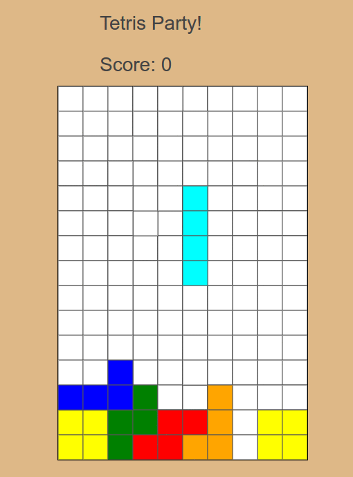

# Tetris Party

Link to [Tetris Party][tetrisParty]

[tetrisParty]: http://www.akshithyellapragada.com/TetrisParty/


Tetris Party is a Tetris clone, where users rotate and move falling pieces so
that they eventually fill up entire rows. Once the pieces reach the top, the
game ends, and players can see their score.

### Structure

Tetris Party is build entirely in JavaScript and HTML5, it uses Canvas to render
the board and pieces, and uses boolean values to efficiently store the state of
the board. 


### Gameplay



### Major Features

#### Efficient Storage of Game State using Booleans

  The entire state of the board and color of pieces is dynamically rendered each
  time by simply testing for truthy or falsey. Piece collision is handled by that
  as well. 

#### Modular Structure

  All the pieces in the game come from one `Piece` class, but change in color and
  pattern using a hash for efficiency and speed.


#### Piece Nuding

  Normally when pieces are at the side, they can't be rotate due to collision
  detection. I added Nudging so that pieces just slightly bounce off the wall and
  rotate in an intuitive manner anyway.


  ```
  rotate() {
    let nextpat = this.patterns[(this.patterni + 1) % this.patterns.length];
    let nudge = 0;

    if (this._collides(0, 0, nextpat)) {
      nudge = this.x > (this.game.width / 2) ? -1 : 1;
    }

    if (!this._collides(nudge, 0, nextpat)) {
      this.undraw();
      this.x += nudge;
      this.patterni = (this.patterni + 1) % this.patterns.length;
      this.pattern = this.patterns[this.patterni];
      this.draw();
    }
  }

```


### Future Features

#### Multiplayer

My biggest end goal for this project is for two people to have the ability to
play against each other. I want to use websockets and express to create a JS
server for this to work. 
